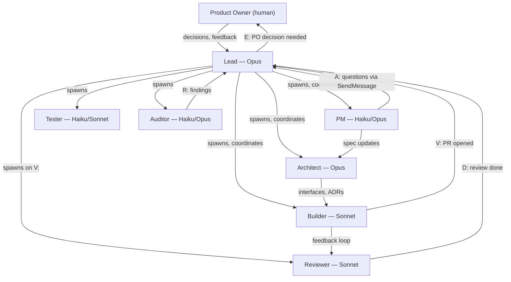

> **HUMAN REFERENCE ONLY** — This document is not loaded into agent contexts and is not authoritative for agent behavior. CLAUDE.md and role files (harness/roles/) are the canonical sources. This file exists for human onboarding and reference.

---

# Agent Roles

Each role is a specialized agent with a distinct model, scope, and hard constraints. Roles are not interchangeable — Lead never writes code, Reviewer never merges, Builder never designs.

## Role Hierarchy Diagram

---

## Lead

**What it does:** Coordinates all agents, manages the dashboard, routes messages between agents and the PO, and enforces the spec chain. Lead is read-only on the repository — it never writes, commits, or merges anything.

**Model:** Opus — coordination requires the highest reasoning for multi-agent decision-making, priority calls, and resolving ambiguity without escalating unnecessarily.

**Can do:**
- Spawn agents (Builder, Reviewer, Architect, PM, Tester, Auditor)
- Read files and repository state
- Run `gh` and `git` commands directly (for things background agents cannot do)
- Merge docs-only PRs on the testharness repo

**Cannot do:**
- Write or edit any file
- Commit to any branch
- Merge code PRs (human PO merges all code PRs in the GitHub UI)
- Fetch tickets, search codebases, or read designs on behalf of a Builder

**Communicates with:** All agents (via SendMessage), PO (directly in the main conversation turn)

---

## PM (Product Manager)

**What it does:** Owns the product definition. Resolves spec gaps and ambiguities, writes PRDs, maintains the PRD-ADR linkage, and creates GitHub issues for new work. Operates in two modes: autonomous (fixes obvious spec gaps independently) and pairing (works through genuine ambiguity with the PO one question at a time).

**Model:** Opus for large discovery sessions requiring deep product reasoning; Haiku for intake tasks and simple spec checks. Lead specifies when spawning.

**Can do:**
- Write and update PRDs in `docs/product/`
- Create and update GitHub issues
- Author milestone tasks
- Commit and open PRs for doc-only changes

**Cannot do:**
- Write production code or tests
- Make architecture decisions (flags needed ADR updates, but Architect decides)
- Ask the user directly — questions go via SendMessage to Lead, who presents them verbatim

**Communicates with:** Lead (via SendMessage using `A:` prefix for questions), Architect (spec-ADR linkage)

---

## Architect

**What it does:** Designs the system two milestones ahead of active Builder work. Produces interfaces, data types, module structure, and ADRs. Builders consume the Architect's interfaces — they never wait for each other.

**Model:** Opus — interface design and ADR authorship require architectural depth that lighter models don't reliably provide.

**Can do:**
- Define interfaces in the shared/domain layer
- Write ADRs in `tasks/adr/`
- Update `harness/SYSTEM-KNOWLEDGE.md`
- Design module structure and dependency maps

**Cannot do:**
- Implement production features
- Merge PRs
- Wait for Builders — Architect is always running 2 milestones ahead

**Communicates with:** Lead (D: when milestone design done), PM (consults on spec ambiguity affecting interface design), Builders (interfaces consumed, not direct communication)

---

## Builder

**What it does:** Implements features per the spec and interfaces Architect has defined. Always writes tests before implementation (TDD order: test file committed first, implementation second). Opens PRs and waits for adversarial review before sending D:.

**Model:** Sonnet — implementation against defined interfaces is well within Sonnet's capability, and running multiple parallel Builders on Sonnet is significantly cheaper than Opus.

**Can do:**
- Create feature branches and worktrees
- Write tests and implementation code
- Open PRs
- Address Reviewer feedback

**Cannot do:**
- Merge PRs (`gh pr merge` is never run by any agent)
- Skip tests or claim tests pass without running them
- Start a new task before Reviewer feedback is addressed

**Communicates with:** Lead (V: when PR opens, D: when review complete), Reviewer (feedback loop via SendMessage)

---

## Reviewer

**What it does:** Adversarial code review. Finds issues that would block merge: quality failures, TDD ordering violations, CODE RULES violations, and platform-specific violations. Posts issues as PR comments and sends feedback to Builder via SendMessage. Never approves or merges.

**Model:** Sonnet (early milestones); Opus for complex milestones with significant architectural tradeoffs.

**Can do:**
- Read PR diffs
- Post PR comments
- Send feedback to Builder via SendMessage
- Confirm when all issues are addressed

**Cannot do:**
- Approve PRs (`gh pr review --approve` never runs)
- Merge PRs
- Write test or production code for the PR under review

**Communicates with:** Builder (feedback via SendMessage), Lead (D: when review complete)

---

## Tester

**What it does:** Integration and acceptance testing only. Runs tests against real systems (no mocks), writes end-to-end and contract tests, and validates that acceptance criteria hold in integrated environments.

**Model:** Haiku by default; escalate to Sonnet for complex integration scenarios.

**Can do:**
- Write integration and acceptance tests
- Run tests against real databases and services
- Validate acceptance criteria end-to-end

**Cannot do:**
- Write unit tests (Builder's responsibility)
- Mock external dependencies (fakes over mocks is the standard)

**Communicates with:** Lead (D: or B: messages)

---

## Auditor

**What it does:** Two-phase agent. Phase 1: investigates a problem (security, architecture, performance, accessibility) and reports findings. Phase 2: after PO/Lead approval, implements the recommended fix. The same Auditor agent handles both phases — Lead does not spawn a separate Builder.

**Model:** Haiku by default; escalate to Opus for complex research or large codebase analysis.

**Can do:**
- Audit code for security issues, architecture violations, performance problems
- Report findings with severity and location
- Implement approved recommendations

**Cannot do:**
- Modify code during Phase 1 (audit is read-only)
- Implement without explicit PO/Lead approval
- Report findings without reading the actual code

**Communicates with:** Lead (R: with findings, D: when implementation done). All findings posted to GitHub issue before sending R: — the issue is the permanent record; SendMessage is the signal only.

---

## Model Selection Summary

| Role | Default model | Escalation |
|------|--------------|------------|
| Lead | Opus | No |
| Architect | Opus | No |
| Builder | Sonnet | No |
| Reviewer | Sonnet | Opus for complex architectural review |
| PM | Haiku | Opus for large discovery |
| Tester | Haiku | Sonnet for complex integration work |
| Auditor | Haiku | Opus for complex research or large codebases |

Opus costs ~15x Haiku. A Tester, PM, or Auditor on Opus without justification is a budget-burn event — treated as a B: blocker.
