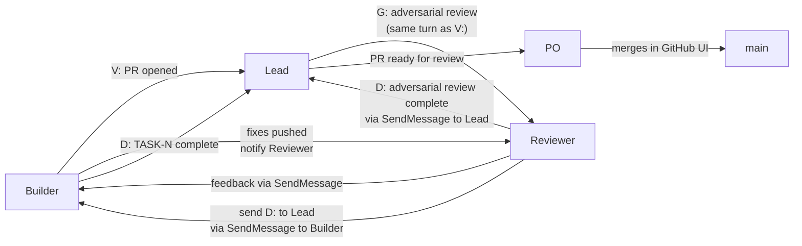

> **HUMAN REFERENCE ONLY** — This document is not loaded into agent contexts and is not authoritative for agent behavior. CLAUDE.md and role files (harness/roles/) are the canonical sources. This file exists for human onboarding and reference.

---

# Communication DSL

Agents communicate using a structured message protocol. Every message starts with a single-letter prefix that tells the receiver what action to take. This removes ambiguity and makes agent coordination scannable.

## DSL Prefix Table

| Prefix | Full name | Sender | Receiver action |
|--------|-----------|--------|----------------|
| `I:` | State update | Any | Read only — no response required |
| `R:` | Discovery done | PM, Architect, Auditor | Lead: send G: to proceed or H: to wait |
| `G:` | Execute | Lead | Agent: begin the specified task |
| `H:` | Wait | Lead | Agent: pause, do not proceed |
| `B:` | Blocked | Any agent | Named agent: resolve the block |
| `D:` | Complete | Any agent | Lead: verify and update dashboard |
| `A:` | Decision needed | PM | Lead: present to PO verbatim |
| `V:` | PR opened | Builder | Lead: spawn Reviewer immediately (same turn) |
| `E:` | PO decision | Lead | Lead: facilitate, do not decide alone |
| `L:` | Pattern identified | Any | Lead: capture in harness within 5 minutes |

### Examples

```
I: b-auth is running tests — no action needed

R: TASK-042 discovery complete. Plan: add JWT validation middleware. No unknowns.

G: b-auth implement TASK-042 per ADR-003. Issue #42. Platform: backend.

H: b-cart wait — b-auth must complete before cart can start.

B: b-auth blocked on missing UserRepository interface — Architect: provide interface spec

D: TASK-042 complete. PR #15 opened. Adversarial review done. Ready for human review.

A: Should the consent modal show a "learn more" link for users without MitID?

V: TASK-042 PR #15 opened. feature/jwt-validation. Platform: backend.

L: Builder skipped DISCOVERY gate — rule: DISCOVERY block required before any implementation
```

---

## How Agent Q&A Works

Agents cannot talk to the PO directly. The relay path is:

```
Agent → SendMessage to Lead → Lead asks PO in main conversation → PO answers Lead → Lead relays to Agent
```

For PM questions specifically, Lead is "transparent glass":
- PM sends `A: [question]` to Lead
- Lead displays it immediately as `**PM:** [question]` — no framing, no "the PM is asking"
- PO answers Lead
- Lead forwards the answer to PM via SendMessage

One question per message. PM never batches questions.

---

## SendMessage Usage

SendMessage is for **coordination signals only** — not for sharing large artifacts or code. Use it to:
- Send DSL prefix messages (`V:`, `D:`, `B:`, `A:`, etc.)
- Pass small context (PR numbers, branch names, feedback summaries)
- Forward PO answers from Lead to agents

Do not use SendMessage to:
- Send full file diffs or code blocks (put them in files and reference the path)
- Duplicate information already in a GitHub issue or PR

**Critical:** Plain text output from an agent is NOT visible to Lead or other teammates. Every status update, completion report, or blocker notification must go through SendMessage.

---

## Dashboard Format

Lead displays the session dashboard after every `D:`, `B:`, or `V:` event — no exceptions.

```
=== SESSION DASHBOARD ===
Milestone: M1 — Age Verification UI Update
Progress: 1/2 tasks (50%) ████░░░░░░
Coverage: 82% (baseline: 80%)
Agents: 3 active

| Task   | Status    | Agent        |
|--------|-----------|--------------|
| TASK-1 | DONE      | b-consent    |
| TASK-2 | IN REVIEW | b-dob-modal  |
| TASK-3 | BACKLOG   | —            |
=========================
```

Percentage = done tasks / total tasks for the current milestone.

---

## PR Lifecycle



### PR Lifecycle Rules

1. **Builder opens PR, then waits.** After sending `V:`, the Builder enters a holding state. It does not start other tasks, does not modify the branch, and does not proceed until Reviewer feedback arrives.

2. **Lead spawns Reviewer the same turn as V:.** Not after verifying, not next turn — the Reviewer spawn happens in the same response as the V: acknowledgement.

3. **Reviewer sends feedback to Builder via SendMessage.** Reviewer also posts issues as PR comments for the permanent record.

4. **All feedback is fixed on the branch.** No "follow-up issue" pattern. Non-blocking suggestions are still fixed before D:.

5. **When Reviewer is satisfied:**
   - Posts PR comment: "Adversarial review complete. All issues addressed. Ready for human review."
   - Sends Builder via SendMessage: "Adversarial review complete. Send D: to Lead."
   - Sends Lead via SendMessage: "Adversarial review complete for PR #N."

6. **Human (PO) merges.** `gh pr merge` is never run by any agent. Self-approval is blocked on GHE solo setup. The PO reviews in the GitHub UI and merges.

7. **Docs-only PRs** (markdown only, no code): Lead merges directly. No Reviewer needed.

---

## Communication Anti-Patterns

| Anti-pattern | Problem | Correct pattern |
|-------------|---------|----------------|
| Agent outputs plain text report | Invisible to Lead | Use SendMessage |
| Lead delays Reviewer spawn | Builder sits idle waiting | Spawn Reviewer same turn as V: |
| PM batches multiple questions | Cognitive overload for PO | One question per SendMessage |
| Builder starts new task after V: | Branch modified mid-review | WAIT after V: — do not proceed |
| Lead fetches ticket before passing to Builder | Lead doing Builder's job | Pass ticket URL to Builder; Builder does discovery |
| Auditor sends findings only via SendMessage | No permanent record | Post to GitHub issue first, then SendMessage R: |
