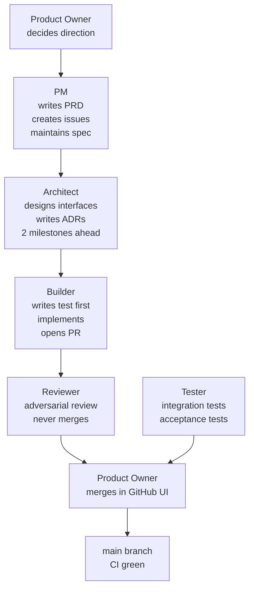

> **HUMAN REFERENCE ONLY** — This document is not loaded into agent contexts and is not authoritative for agent behavior. CLAUDE.md and role files (harness/roles/) are the canonical sources. This file exists for human onboarding and reference.

---

# Milestone Workflow

A milestone is a set of related tasks that, when complete, deliver a meaningful increment of product value. The harness enforces a strict spec-chain from product definition through implementation to CI green.

## The Spec Chain

Every feature follows this order — no steps skipped, no steps reversed:

```
spec → interface → failing test → implementation → CI green
```

1. **Spec** — PM writes the PRD. Acceptance criteria are defined in plain language. Builders read tests, not specs directly.
2. **Interface** — Architect defines the contracts: data types, repository interfaces, use-case signatures. Builders consume interfaces; they do not invent them.
3. **Failing test** — Builder writes a test that expresses the spec requirement. The test must fail before any implementation is written. The test file is committed first.
4. **Implementation** — Builder writes the minimum code to make the test pass. Test names are spec language.
5. **CI green** — All tests pass, all quality gates pass, no regressions.

**Test naming rule:** Test names read like spec requirements. `it should show the consent modal when user has age-restricted items in cart` not `test_modal_shows`.

**TDD ordering enforcement:** Reviewer checks `git log --diff-filter=A` to verify the test file appears in an earlier commit than the implementation file. Same commit requires a note in the commit message confirming test was written first.

---

## How the Roles Fit



### Role Responsibilities in the Spec Chain

| Role | Spec chain responsibility |
|------|--------------------------|
| PM | Authors spec (PRD), creates GitHub issues with acceptance criteria, updates spec when product changes |
| Architect | Translates spec into interfaces and ADRs; identifies all edge cases as interface contracts |
| Builder | Reads interfaces and tests — not spec directly; writes failing test first, then implementation |
| Reviewer | Verifies TDD ordering, quality gates, and that acceptance criteria are met per the SELF-AUDIT block |
| Tester | Validates acceptance criteria hold in integrated environments |
| PO | Final decision on whether the milestone deliverable meets the product vision |

---

## Milestone Structure

Each milestone follows this format in `tasks/MILESTONES.md`:

```
## M[N]: [Name]
Goal: [one sentence]
Status: BACKLOG | IN PROGRESS | DONE
Tasks:
| # | Task | GitHub Issue | Files |
|---|------|-------------|-------|
| 1 | [description] | #N | [file paths] |
Completion Gates:
[standard 6 gates]
```

### 6 Completion Gates (every milestone)

A milestone is complete only when ALL of these are true:

1. All tasks in milestone are DONE and merged to main
2. CI green on main
3. Project compiles and runs on all target platforms
4. PO validation — PO has reviewed and accepted the milestone deliverables
5. `harness/SYSTEM-KNOWLEDGE.md` updated with milestone module status
6. Retrospective written using `harness/templates/RETRO-TEMPLATE.md`

---

## Architect Continuity Rule

Architect never idles. When Architect finishes M(N) design, Lead immediately assigns M(N+1) and M(N+2) design. This ensures Builders always have interfaces ready when they start a milestone.

```
Architect timeline:  [M1 design]--[M2 design]--[M3 design]--...
Builder timeline:             [M1 build]-----[M2 build]-----...
```

Builders start M(N+1) after M(N) completion gates pass — Architect is already done with M(N+1) design by then.

---

## DISCOVERY Gate

No Builder writes code before completing the DISCOVERY gate and receiving Lead's G:.

```
DISCOVERY: [TASK-ID]
READ: [files read — role file, interfaces, relevant ADRs]
UNDERSTAND: [2-3 sentences: what this task does and what interfaces it uses]
UNKNOWNS: [list anything unclear, or NONE]
PLAN:
  - [ ] Write test: [test name]
  - [ ] Implement: [class/function name]
  - [ ] Add platform stub: [if needed]
  - [ ] Register DI: [module name]
  - [ ] Create PR closing #[N]
R: yes | blocked:[reason]
```

Self-GO for trivial tasks (under 50 lines, single file, no new interfaces): include `SELF-GO:` in the block and proceed without waiting for Lead.

---

## VERIFICATION Gate (before D:)

Before sending D:, Builder must verify:

1. Run tests — zero failures
2. Run coverage — must meet or exceed baseline
3. Verify each acceptance criterion in the GitHub issue
4. `git diff main` — self-review
5. "Would a staff engineer approve this?" — if no, fix first

Every D: message must include a SELF-AUDIT block:
```
SELF-AUDIT:
- Tests: zero failures (ran [test command])
- Coverage: [N]% (baseline: [N]%)
- Acceptance criteria:
  - [criterion 1]: PASS
  - [criterion 2]: PASS
- git diff main: reviewed, no regressions
- Staff engineer bar: yes
```

---

## PRD-ADR Linkage

PM and Architect maintain cross-references between product docs and architecture decisions:

- Every PRD (`docs/product/`) includes a `## Related ADRs` section
- Every ADR (`tasks/adr/`) includes a `## Product spec` reference

When PM updates a PRD, PM checks whether the change invalidates any linked ADRs and flags them. Architect makes the final call on ADR updates.

---

## Fakes Over Mocks

The harness uses fakes (real implementations with in-memory backing) over mocks (stub objects). This matters because:

- Fakes exercise real interface contracts — a mock can pass when the real behavior would fail
- Fakes can be shared across test suites — every test uses the same `FakeUserRepository`
- Mocks encourage structure-sensitive tests that break when private method names change

Builder provides:
```
src/domain/UserRepository.kt         <- interface (Architect defines)
src/data/UserRepositoryImpl.kt       <- production implementation
src/test/fakes/FakeUserRepository.kt <- fake for tests
```

See `harness/TDD-STANDARDS.md` for fake patterns and contract test structure.
