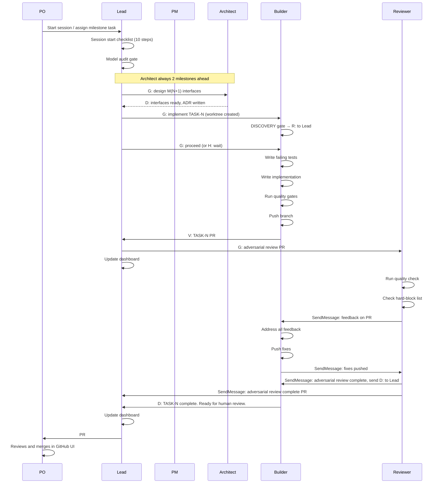

> **HUMAN REFERENCE ONLY** — This document is not loaded into agent contexts and is not authoritative for agent behavior. CLAUDE.md and role files (harness/roles/) are the canonical sources. This file exists for human onboarding and reference.

---

# Session Lifecycle

A session is a bounded unit of work — typically 2-3 hours — that starts from a known state, makes progress on milestone tasks, and ends with a complete handoff for the next session.

## Session Start Checklist

Run these in order before spawning any agent:

1. Read `LAUNCH-SCRIPT.md` — the previous session's handoff with open PRs, blocked tasks, and pending harness updates
2. `git fetch origin` then `git pull origin main` — ensure you have the latest main
3. `git log --oneline -20` — understand what changed since last session
4. Read `tasks/MILESTONES.md` — find the current milestone and task status
5. If `tasks/PRODUCT-BRIEF.md` is missing — spawn PM before any feature work
6. Check active and blocked GitHub issues
7. Read `harness/SYSTEM-KNOWLEDGE.md` — module status and known gotchas
8. Read relevant `tasks/adr/` entries for the current milestone
9. Read `harness/SKILLS-INDEX.md` — know what skills exist (don't load all, load lazily)
10. Read your role file from `harness/roles/`

**Model audit gate (before any G: messages):** Verify every active agent is on the correct model. Haiku-class roles (PM, Tester, Auditor) on Opus without justification = budget-burn blocker.

---

## Active Work Phase

### Typical Feature Session Flow



### Agent Q&A (Blocked Agent)

When a Builder hits an ambiguity it can't resolve:

1. Builder sends `B: [description]` to Lead via SendMessage
2. Lead displays it in the dashboard and resolves it:
   - If it's a product question: routes to PM
   - If it's an architecture question: routes to Architect
   - If it's a spec contradiction: escalates to PO
3. Resolver sends answer to Lead; Lead forwards to Builder via SendMessage
4. Builder continues with `G:` from Lead

### PM Pairing (Product Ambiguity)

When PM needs PO input:

1. PM sends `A: [question]` to Lead via SendMessage
2. Lead presents it verbatim as `**PM:** [question]` — no framing, no commentary (Lead is transparent glass)
3. PO answers Lead
4. Lead forwards answer to PM via SendMessage immediately
5. PM processes and may ask the next question (one at a time)

---

## Session End Shutdown Sequence

Order matters: Builders first → Architect → Reviewer last. Never close PRs while agents are still running.

### 6 Mandatory Shutdown Deliverables

**1. Write Lessons (`harness/lessons.md`)**
Append new entries for patterns discovered this session. Each L: event from the session should have a corresponding entry. Format:
```
## Session YYYY-MM-DD
### WHAT_I_DID
### WHAT_WAS_WRONG
### CORRECTION
### PATTERN
```

**2. Create Harness Recommendations Issue**
File a GitHub issue listing specific file changes needed based on this session's patterns. This becomes the first task of the next session.

**3. Write Build Journal Entry (`docs/BUILD-JOURNAL.md`)**
Append: PRs merged, bugs fixed, coverage delta, agent spawns, what happened, what went wrong, key decisions, what was NOT done.

**4. Write Launch Script (`LAUNCH-SCRIPT.md`)**
Overwrite (not append) with the current state: open PRs, open issues, remaining milestone tasks, pending harness updates, and startup checklist.

**5. Commit All Deliverables and Open PR**
```bash
git add harness/lessons.md docs/BUILD-JOURNAL.md LAUNCH-SCRIPT.md harness/SYSTEM-KNOWLEDGE.md
printf 'harness(session): shutdown deliverables YYYY-MM-DD\n\nCo-Authored-By: Claude Sonnet 4.6 <noreply@anthropic.com>\n' > /tmp/commit-msg.txt
git commit -F /tmp/commit-msg.txt
git push -u origin harness/shutdown-YYYY-MM-DD
```

**6. Clear Session Overrides**
Reset all `## Session Overrides` sections in ROLE-*.md files to `_None — cleared at session end._`

### Worktree Cleanup

```bash
git worktree list
git worktree prune
# For each completed agent worktree:
git worktree remove ../b-feature-name
```

---

## Session Length Guidance

- Cap at 3 hours — context quality degrades significantly after this
- At 2 hours: write handoff notes even if session continues
- A fresh session with a good launch script beats a long session with degraded context
